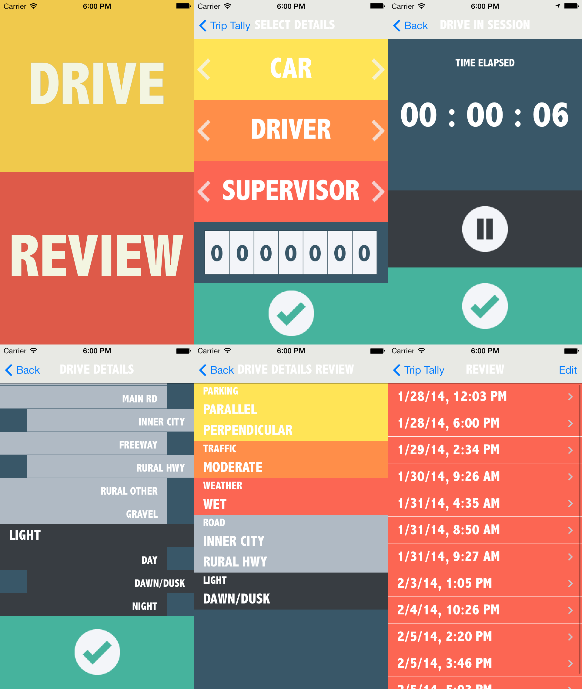

Trip Tally
================

Trip Tally is a tool to quickly, easily, and conveniently log your drives. Perfect for learner drivers accumulating practice hours, you can leave the log book at home. Don't let any more hours go to waste after you've forgotten your log book! Let Trip Tally create your log book entries for you, so you can get back to the driving, and earn your license faster.

Designed to suit Victoria, Australia's format of log book. Can be easily extended for the driving criteria used in other state's logbooks by creating another plist file like the vicCriteria.plist file.

- Records essential information needed for a VicRoads logbook entry, like driver, supervisor, car identifier, start and finish times, and driving conditions.
- Sorts and presents logbook entries for future review, and for copying into the physical logbooks.
- Automatically calculates distance travelled using GPS.
- Times your trip for you.
- Can save and delete common drivers, cars, and supervisors.
- Records details such as parking, lighting conditions, and road types.
- Considers 'Night driving' as any time after 7pm
- All iPhone resolutions compatible
- iOS 6+

**Screenshots**

The image below shows the different screens in the app.

